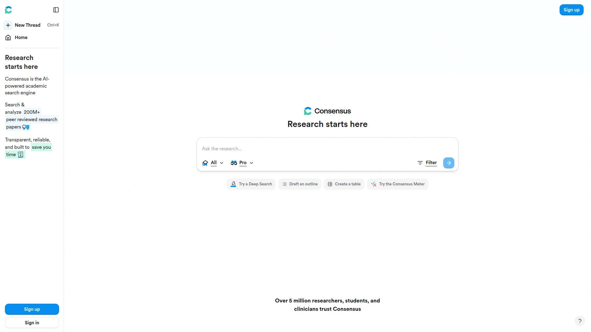

# 2025年十大最佳AI智能搜索平台

用更聪明的方式找答案，省去来回点链接的时间，AI搜索会直接用对话式结果和可追溯引用给出清晰结论，适合需要实时信息与可靠“来源标注”的用户。常见场景包括选品对比、行业研究、学术检索与新闻动态，目标是更快拿到靠谱答案，同时把“部署门槛”和学习成本压到最低。如果你看重可控成本、覆盖范围与准确率，下列工具能在效率与稳定性之间取得更好的平衡。整体来看，AI搜索正快速成熟，但仍需配合核验来源以避免误导信息。

## [Perplexity](https://pplx.ai/ixkwood69619635)
对话式答案引擎，重视来源与细节。

- 特色：整合实时网页搜索与引用链接，支持多轮追问、步骤轨迹、对比表格，适合复杂问题的结构化解答。
- 体验：回答速度快、格式友好，能按来源展开细查，减少“翻蓝链”的时间成本。
- 进阶：提供付费档获取更强模型与高级检索，“Comet”浏览器将搜索助手前置到上网流程中。
- 适合人群：内容研究、选型对比、行业趋势与新闻追踪用户。

## [Google Web Guide](https://www.google.com/)
实验性“整页式”结果页，按意图分组链接并给简洁概览。
- 特色：用Gemini把结果组织成主题块，更像“查询落地页”，减少东跳西点。
- 使用门槛：需在Search Labs中启用，暂未全球普及，适合快速扫清方向。
- 取舍：不可追问、链接数量有限，但可迅速定位入口，再自行深挖。
- 适合人群：需要快读概览的人群，如临时调研、素材集锦。

## [Google AI Mode](https://www.google.com/)
在经典搜索上叠加对话式答案，强调速度与视觉信息。
- 特色：以Gemini与知识图谱为底，提供多模态丰富呈现，便于快速浏览核心事实。
- 优势：自然语言理解较强，历史事件等结构化知识回答稳定。
- 注意：引用不够一致、部分地区/场景限制，仍带实验属性。
- 适合人群：希望在Google体系里获得更“会说话”的结果的人。

## [Microsoft Copilot（Bing）](https://copilot.microsoft.com/)
融合Bing索引与GPT系列模型，长于结构化引用与办公生态整合。
- 特色：以列表/要点呈现答案，附权威来源链接，支持文字、语音与图像输入。
- 生态：与Word/Excel/Teams/Edge协同顺畅，适合日常办公场景串联。
- 体验：有“深想”模式加强复杂任务，界面信息量大需适应。
- 适合人群：深用微软生态、重效率的团队与职场用户。

## [Brave Search](https://search.brave.com/)
独立索引+“Answer with AI”，隐私优先的清爽搜索体验。
- 特色：非Google/Bing底库，减少外部偏置；可一键AI回答并支持追问。
- 体验：界面干净，回答凝练；对极复杂问题深度略不足。
- 加值：与隐私浏览器联动，付费档可去广告巩固专注度。
- 适合人群：重视隐私与干净界面的用户。

## [ChatGPT Search](https://chatgpt.com/)
把“对话”做到极致的搜索体验，更擅长迭代式提问与头脑风暴。
- 特色：在对话中逐步澄清意图，引用来源并可语音交互，适合需要反复打磨问题的人。
- 能力：处理自然语言的上下文保持好，回答细致但偏文本型。
- 注意：偶有幻觉，进阶模型需付费解锁。
- 适合人群：深度探索主题、方案构思与调研的个人与小团队。

## [Arc Search](https://arc.net/)
“Browse for Me”自动生成主题页，移动端体验流畅。

- 特色：扫描网页后输出精编页面，含摘要、引述与多媒体，像把“读网页”外包给助手。
- 体验：手机端干净快速，桌面端功能在补齐；附语音交互与多项AI便捷功能。
- 取舍：适合快读和整理，不替代深度研究；复杂主题需结合原文验证。
- 适合人群：移动优先、追求“结果即页面”的人。

## [You.com](https://you.com/)
可选模型与结果偏好，集合生产力工具的AI搜索。

- 特色：支持多模型与个性化设置，侧栏聚合来源/图片/视频/资讯，查用一体。
- 体验：对话与多模态并行，免费层广告与信息密度需适应。
- 适合人群：希望把搜索、草拟、编程与总结放在同一工作流的人。
- 成本：进阶功能与大模型访问提供订阅档位选择。

## [Komo AI](https://komo.ai/)
免费起步的可视化搜索，支持模型切换与多种模式。
- 特色：Ask/Research/Search/Explore四种路径，附思维导图式展示与模型选择。
- 体验：上手简单、视觉导向强，复杂问题深度与速度需权衡。
- 适合人群：偏好“所见即所得”与交互式导航的新手与创作者。
- 成本：免费可用，高阶模型与研究功能提供付费方案。

## [Consensus](https://consensus.app/)
为学术而生的AI检索，直达论文并汇总“共识”。

- 特色：针对科学问题汇整关键结论，分层次读取论文数量以平衡速度与深度。
- 体验：引用清晰、可追问，适合学生、研究者以及科学好奇者。
- 取舍：场景偏学术，通用日常问题建议与通用引擎搭配使用。
- 成本：免费层有额度，高阶解锁更多“Pro/Deep”检索。

### 常见问题
- AI搜索什么时候更合适？
当你需要“可追溯引用+快速结论”的任务，如产品对比、市场脉络、学术切入点、新闻脉冲时更省时，且可通过追问细化答案。
- 如何快速上手并保证准确？
优先选择支持来源标注的引擎，先看概览再点开关键来源交叉验证，必要时用不同引擎交叉比对。
- 隐私和可控成本怎么兼顾？
选择提供独立索引与隐私优先策略的工具，并按需订阅更高模型/高级功能，平衡速度、深度与预算。

### 结语
如果只选一个开始，优先尝试[Perplexity](https://pplx.ai/ixkwood69619635)获取带引用、结构化的高质量答案，作为你的日常“信息起点”会更稳。对需要视觉化或生态整合的用户，可再按上文清单搭配组合，逐步形成覆盖更广、成本可控的“AI搜索栈”。为什么#1适合做“通用检索主力”？因为它在准确性、引用透明度与对话探索之间取得了难得的平衡。
